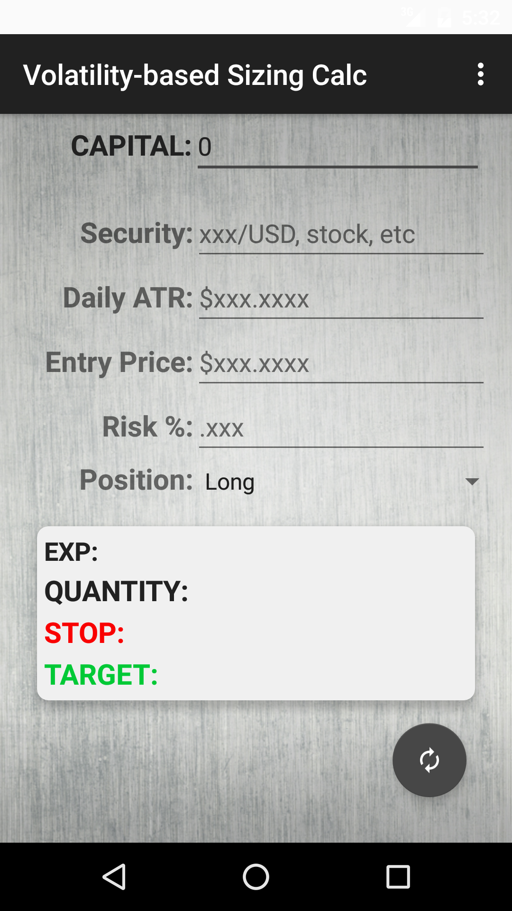
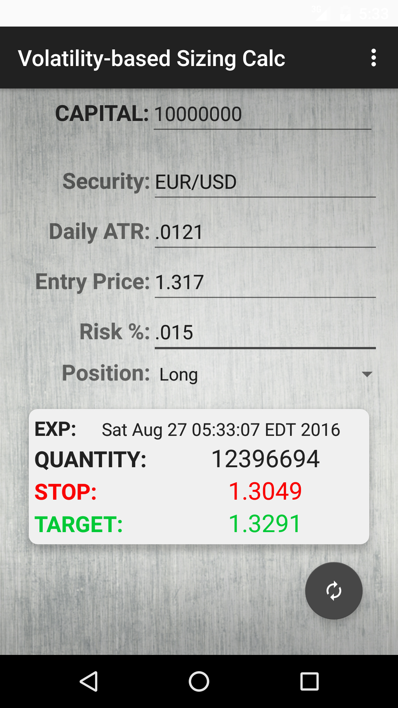

# **Application: Forex Position Calculator**
## **Developer: Mike Kwon**
## **Contact: Kwondeveloper@gmail.com**

---

#### Description

-Calculator that determines Stop-Loss and Profit Targets for a position based on user's current capital, estimated volatility, and their risk threshold.  Position length is calculated based on the exact time that all metrics are calculated.

---